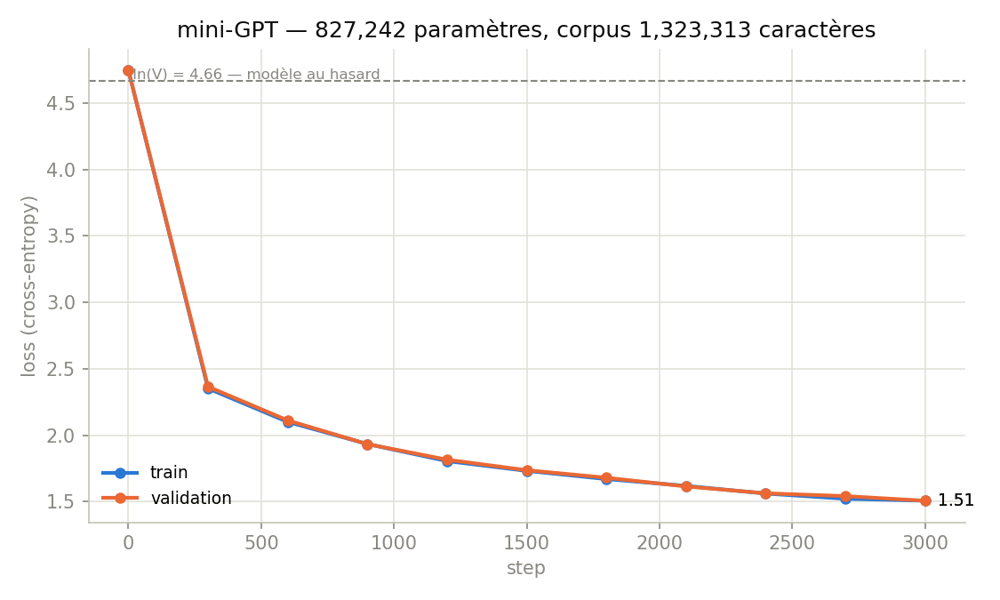

# mini-GPT from scratch, trained on Dumas

I built a small GPT (a decoder-only transformer, GPT-2 style) from scratch in PyTorch, then trained it character by character on Alexandre Dumas' *The Three Musketeers*. I coded every piece myself: the character tokenizer, the multi-head causal self-attention, the training loop and the sampler, with no high-level library. The point wasn't to build something big, it was to really understand what happens inside a language model by building one.



## How it works

Each transformer block does two things. First the tokens "talk to each other" through causal self-attention (a triangular mask stops a position from peeking at the future, which is what makes text generation possible). Then each token is processed on its own by a small feed-forward network. Both steps use pre-normalization and residual connections, the trick that lets you stack several blocks and still train them. On top I add learned token and position embeddings, a final LayerNorm and a linear head. It's the GPT-2 recipe, just tiny.

## The setup

| | |
|---|---|
| Parameters | 827,242 |
| Architecture | 4 layers, 4 heads, embedding 128, context 64 |
| Corpus | *The Three Musketeers* (Dumas), 1,323,313 characters, 106-char vocabulary |
| Split | 1,190,981 train / 132,332 validation tokens |
| Training | AdamW, lr 3e-4, dropout 0.1, 3000 steps, about 25 h on my laptop CPU |

## Results

The loss drops from 4.89 to 1.51. Two things I found satisfying here.

First, the initial loss lands almost exactly on `ln(106) = 4.66`. That's the loss of a model that knows nothing and picks each character at random, so hitting it confirms the weights are initialized correctly (getting this wrong is a classic silent bug). Second, train and validation loss stay basically identical the whole way (1.507 vs 1.507), so the model is learning real patterns, not just memorizing the book.

Before training, the output is pure noise:

```
T«ïrÉ«eeÀU wüçüXàb61'çÈqücêÈ!l'…LrdWÊÉcTCRs!Ê—YgÇÇÛJ—;d3Lià3(YHÎëz...
```

After training (temperature 0.5), it writes readable French, complete with the novel's own characters and dialogue punctuation:

```
— Mais de Tréville et de cela? dit Milady son au contre que vous
doutes pour l'heures de les femmes de l'avait de suis sa reçu, et
confermaine et par lui il avait au d'ablance.

— Et demi, dit Porthos en de la barien, et je vous est provenir à
d'Artagnan, et le premient de l'avait en sa la rien de
```

Turn the temperature up to 1.5 and it gets more creative but loses the thread, the usual trade-off when sampling:

```
— Je peuffait et poux; estrant Athos.
«Ah! répinquillement:
«Voi mercouronnaçad, Lorçon…»
```

So with under a million parameters and no notion of words (it works one letter at a time), it already picks up Dumas' vocabulary, character names and the look of his dialogue, just not full grammar. That's kind of the whole lesson: the architecture is the same one behind the models that *do* write fluently, and the rest is mostly scale (more parameters, more data, more compute).

## Try it

```bash
pip install torch
python minigpt_dumas.py
```

It trains the model and prints samples at three temperatures. Point `CORPUS_URL` at any UTF-8 text file to train on something else.

## What I'd do next

It's a learning project, so it's deliberately small and character-level. The obvious next steps: a BPE tokenizer, a bigger model and longer context on a GPU (my CPU run took a full day), KV-caching for faster generation, and a modern positional scheme like RoPE.

## Credits

Architecture based on the decoder-only transformer from Vaswani et al. (2017), GPT-2 style, and inspired by Andrej Karpathy's nanoGPT. Text: public-domain Dumas from Project Gutenberg. MIT License.
